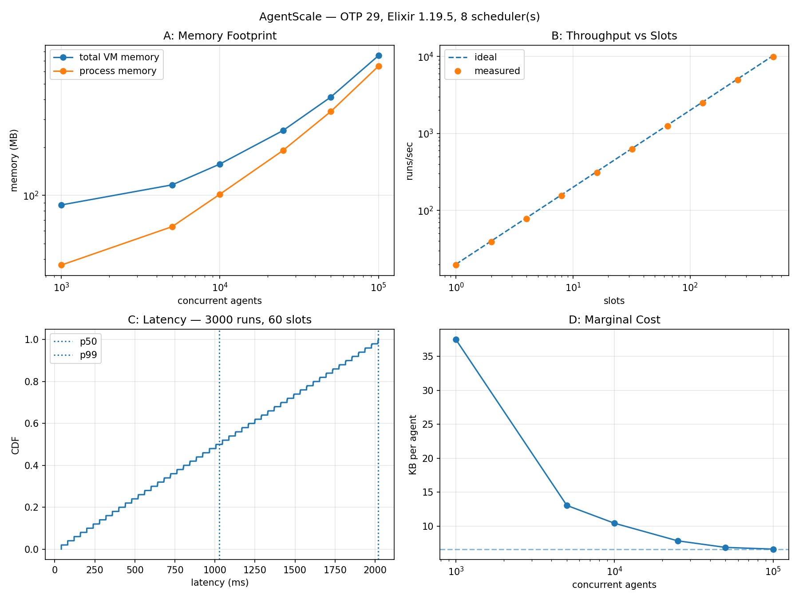
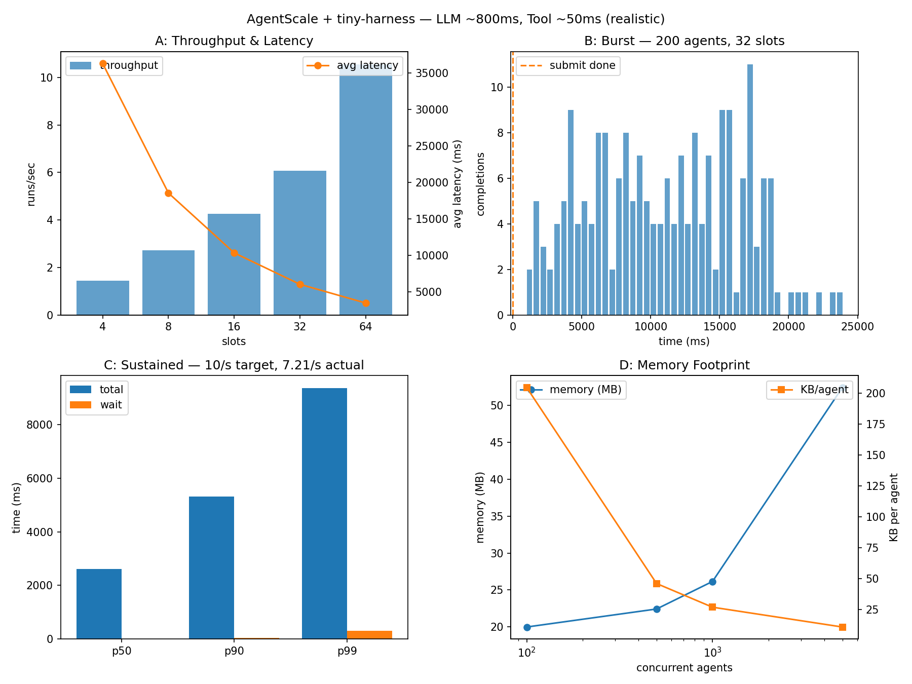

# AgentScale

Scale agent workloads with BEAM. AgentScale wraps each run in supervised process and monitors the shared inference pool.

## Quick Start

```elixir
# Start a run
{:ok, session_id} = AgentScale.run(worker: AgentScale.Worker.Fake)

# Subscribe to events
AgentScale.subscribe(session_id)

# Receive events
receive do
  {:agent_scale, ^session_id, event} -> IO.inspect(event)
end
```

## Workers

Workers implement the `AgentScale.Worker` behaviour:

```elixir
defmodule MyWorker do
  @behaviour AgentScale.Worker

  @impl true
  def stream(run_pid, request) do
    # Connect to your agent service, stream events...
    send(run_pid, {:agent_scale_event, {:step, %{n: 1}}})
    send(run_pid, {:agent_scale_done, :ok})
  end
end
```

Built-in workers:

* `AgentScale.Worker.Fake` Synthetic events for testing
* `AgentScale.Worker.Bench` Sleep-based worker for benchmarks

## Configuration

```elixir
# config/config.exs
config :agent_scale, :max_slots, 16
```

Default is `System.schedulers_online() * 2`.

## Run the Demo

```sh
iex -S mix
iex> {:ok, id} = AgentScale.run(); AgentScale.subscribe(id)
```

## Measured Results

MacBook Apple M3, 8 schedulers, OTP 29, Elixir 1.19.5. Runs are I/O-bound, each agent is parked on a simulated inference call.

**A: Massive concurrency.** Agents held simultaneously live (barrier-synchronised), peak process memory measured at the barrier:

| concurrent agents | live processes | process memory | per agent |
|---:|---:|---:|---:|
| 1,000   | 2,120   | 37 MB  | 38 KB |
| 10,000  | 20,120  | 102 MB | 10 KB |
| 50,000  | 100,120 | 335 MB | 7 KB |
| 100,000 | 200,120 | 646 MB | 6.6 KB |

100k concurrent in-flight agents in ~0.65 GB of process memory (~0.75 GB total VM). Each agent ≈ two BEAM processes (the supervised run + its worker); fixed cost ~6.6 KB/agent.

**B: Backpressure.** Completed runs/sec tracks `slots / service_time` almost exactly 97% at 512 slots (9,929 vs 10,240 r/s).

**C: Latency.** 3,000 runs through 60 slots: orderly queueing, latency saturating at the ideal makespan `⌈N/slots⌉ × service ≈ 2.0s` (p50 1.0s, p90 1.8s, p99 2.0s).

### Synthetic Benchmark

Measures raw BEAM overhead with minimal simulated work per agent.



* **A: Memory Footprint** Total VM and process memory as concurrent agents scale from 1k to 100k. Log-log scale shows sub-linear growth.
* **B: Throughput vs Slots** Completed runs/sec tracks the ideal `slots / service_time` nearly perfectly, proving the limiter meters load linearly.
* **C: Latency CDF** Cumulative distribution of end-to-end latency under backpressure. Vertical lines mark p50 and p99. No latency explosion under load.
* **D: Marginal Cost** Memory per agent decreases as fixed costs amortize. Asymptotes to ~6.5 KB/agent at scale.

### tiny-harness Simulation

Simulates realistic ReAct-style agent runs with LLM latency (~800ms) and tool calls (~50ms).



* **A: Throughput & Latency** Throughput scales with slot count while average latency decreases. Shows the tradeoff between concurrency and queueing.
* **B: Burst Completion** Timeline of completions after submitting a burst of agents. Shows orderly draining through the slot limit.
* **C: Sustained Load** Latency percentiles (p50/p90/p99) under continuous arrival. Compares total latency vs wait time in queue.
* **D: Memory Footprint** Memory usage and per-agent overhead as concurrent agents increase.

## License

MIT
